# KuaiRec recommender

[](https://github.com/njbabani/kuairec-recsys/actions/workflows/ci.yml)
[](https://github.com/njbabani/kuairec-recsys/actions/workflows/ci.yml)
[](pyproject.toml)
[](https://github.com/astral-sh/uv)
[](https://github.com/astral-sh/ruff)
[](LICENSE)

[](#two-tower-model)
[](#re-ranking)
[](#pipeline)
[](#experiment-tracking)
[](#experiment-tracking)
[](#streamlit-demo)
[-lightgrey)](#dataset-and-citation)

A short-video recommender built on [KuaiRec](https://kuairec.com/), along with a way to A/B test
it against real user reactions.

KuaiRec comes from Kuaishou, a TikTok-style app. Alongside the usual logged feed it has a
"fully observed" matrix: 1,411 users who each reacted to almost all of the same 3,327 videos
(99.6% of the cells are filled). That matrix is why I picked this dataset. When you know how
every user reacted to every video, you can simulate an A/B test properly. Each arm gets its own
recommendations, you look up what the user actually did with them, and since you also know what
they would have done in the other arm, you know the true effect the test is trying to estimate.

## Summary

The recommender has two stages. A PyTorch two-tower model picks each user's top 200 videos and a
LightGBM LambdaRank model re-orders them. On 1,112 test users that I only opened at the very end,
it gets an NDCG@10 of 0.306. That's 0.017 better than the two-tower model on its own (95% CI
+0.006 to +0.027, paired on the same users) and 0.035 better than ALS.

The A/B testing side covers power analysis, CUPED, sample-ratio checks and sequential testing,
and every one of them is checked against the known true effect. An A/A test flags 4.7% of
experiments as significant at alpha = 5%. Peeking at the results ten times pushes that to 20%,
and always-valid p-values bring it back down to 1%.

The part I find most interesting is where the two disagree. Comparing models offline on the same
users picks up the re-ranker's small gain easily. A normal A/B test on those same 1,112 users
can't see it at all. It would need roughly 9,300 users to detect it reliably (4,200 for
two-tower against ALS), so the test reports "inconclusive", which is the right call.

It all runs as a DVC pipeline with data checks, resumable training, MLflow and W&B tracking and
CI, and there's a [Streamlit demo](#streamlit-demo) for exploring the results.

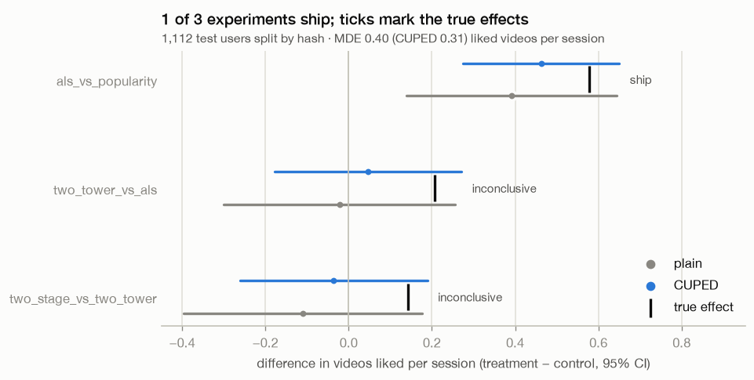

## What's in here

- A DVC pipeline with a checksummed, retrying download and every setting in `params.yaml`
- Data checks with pandera schemas, plus guards against train/eval leakage, broken references
  and duplicate logs
- An EDA notebook on duration bias, exposure bias and how the logs were collected
- Relevance labels corrected for video length
- Baselines: random, popularity by views and by engagement, category affinity, and ALS with a
  grid search
- A two-tower model in PyTorch (pointwise loss against in-batch softmax with logQ correction),
  with multi-seed selection and seed ensembles
- Resumable checkpoints for training and for the hyperparameter search
- A LightGBM LambdaRank re-ranker over 19 features, explained with TreeSHAP
- Per-user ranking metrics with bootstrap intervals, paired comparisons, coverage and
  popularity bias
- Experiment tracking in MLflow and Weights & Biases, with a W&B Sweeps config
- The A/B framework: power analysis, hash-based assignment, Welch's t-test, CUPED, sample-ratio
  and balance checks, a guardrail metric, A/A tests, peeking and always-valid p-values
- A Streamlit app, tested headlessly with Streamlit's `AppTest`
- uv, ruff, pytest with an 80% coverage gate, and GitHub Actions

## Quickstart

You need [uv](https://docs.astral.sh/uv/), which installs Python 3.12 for you. Budget about
1.5 GB of disk and 5 GB of RAM (the `prepare` stage peaks around 4 GB). On macOS, LightGBM also
needs the OpenMP runtime: `brew install libomp`.

```bash
git clone https://github.com/njbabani/kuairec-recsys.git && cd kuairec-recsys
make setup        # create the environment from uv.lock
make data         # download KuaiRec (432 MB), validate, label and split
make eda          # re-run the EDA notebook and refresh the figures
make experiments  # model searches, re-ranker, test evaluation, A/B (about 30 min on an M4)
make results      # refresh the results notebooks and figures
make demo-data    # build the demo's tables
make demo         # open the Streamlit demo at http://localhost:8501
make test         # run the tests
```

Run `make` on its own to see every command.

## Pipeline

The pipeline lives in [`dvc.yaml`](dvc.yaml). `dvc repro` only re-runs the stages whose code,
parameters or inputs have changed, and `dvc.lock` pins the hash of every output.

```
download ──> prepare ──┬──> split ────┬──> als_search        (ALS grid on the tune users)
                       │              ├──> two_tower_search  (two-tower grid, scored every epoch)
                       └──> features ─┴──> leaderboard       (every model + paired comparisons)
                                                 │
                                                 └──> retrieval ──> reranker  (stage 2 + SHAP)
                                                                       │
                                                  final_evaluation <───┘  (test users, once)
                                                         │
                                                         └──> ab_test  (simulated A/B tests)
                                                                 │
                                                                 └──> demo_data  (demo tables)
```

`two_tower_search`, `leaderboard` and `final_evaluation` read both the splits and the features,
and `demo_data` also reads the splits and the video categories. The `retrieval` stage scores
every pair the later stages need with the saved two-tower models. That way `reranker` and
`final_evaluation`, which use LightGBM, never have to load PyTorch. On macOS the two libraries
ship clashing OpenMP runtimes and crash if they share a process.

| Stage | What it does | Output |
|---|---|---|
| `download` | Streams `KuaiRec.zip` from Zenodo with retries, checks its MD5 and writes it atomically, or reuses a verified local copy | `data/raw/KuaiRec.zip` |
| `prepare` | Cleans and types six tables, checks for train/eval leakage and broken references, and validates the schemas | `data/processed/*.parquet`, [`reports/data_summary.json`](reports/data_summary.json) |
| `split` | Splits train and validation by time and the fully observed users into tune and test by hash, then fits the debiased labels on train and applies them everywhere | `data/splits/{train,valid,tune,test}.parquet`, [`reports/split_summary.json`](reports/split_summary.json) |
| `features` | Builds user features (profile categories, log counts) and video features (categories, log length), none of them derived from reactions | `data/features/{users,videos}.parquet` |
| `als_search` | Fits a grid of ALS models on train, scores each on the tune users and logs every trial | [`reports/metrics/als_search.json`](reports/metrics/als_search.json) |
| `two_tower_search` | Trains each two-tower configuration, scores it on tune after every epoch and logs a training curve for each | [`reports/metrics/two_tower_search.json`](reports/metrics/two_tower_search.json) |
| `leaderboard` | Fits every model with its chosen settings, evaluates them on the tune users with paired comparisons, and saves the trained two-tower models | [`reports/metrics/leaderboard.json`](reports/metrics/leaderboard.json), `models/two_tower/` |
| `retrieval` | Scores every (user, video) pair in the validation week and the tune and test matrices with the saved two-tower ensemble | `data/retrieval/two_tower_scores.parquet` |
| `reranker` | Trains the LightGBM re-ranker on the validation week, evaluates the two-stage pipeline on the tune users and explains it with TreeSHAP | [`reports/metrics/reranker.json`](reports/metrics/reranker.json), `models/reranker/` |
| `final_evaluation` | Scores every frozen model once on the 1,112 test users and writes each policy's 10-video session for every one of them | [`reports/metrics/test_evaluation.json`](reports/metrics/test_evaluation.json), `data/ab/sessions.parquet` |
| `ab_test` | Looks up what each test user did with every session, splits users into arms by hash, and runs the power analysis, the experiments and the A/A, peeking and logging-bug checks | [`reports/metrics/ab_test.json`](reports/metrics/ab_test.json), `data/ab/user_outcomes.parquet` |
| `demo_data` | Packs what the demo shows: each test user's sessions with the video's category, length and the user's reaction, plus their history before the experiment | `data/demo/{sessions,users}.parquet` |

There's no DVC remote. The raw data is public, so `dvc repro` rebuilds everything from Zenodo,
and since `dvc.lock` records every output's hash, any drift shows up in `dvc status`.

## What the data looks like

The full analysis is in [`notebooks/01_eda.ipynb`](notebooks/01_eda.ipynb). Three things shaped
everything after it.

### Watch ratio mostly measures how short a video is

People watch a median of about 7.5 seconds no matter how long the video is. So the obvious
label, "watch ratio of 2 or more means they liked it", is positive for two thirds of views of the
shortest videos and almost none of the longest. Train on that and the model learns to recommend
short videos.

Instead, a view counts as positive when its watch ratio beats the 80th percentile of training
views of videos with a similar length, using log-spaced length buckets no more than 15% wide.
This is the duration-bucketing idea from D2Q (Zhan et al., KDD 2022). Across 10%-wide slices of
video length, the positive rate now stays between roughly 9% and 25%, where the naive label
ranged from 0.5% to 62%. The split summary tracks this, so a regression would show up.

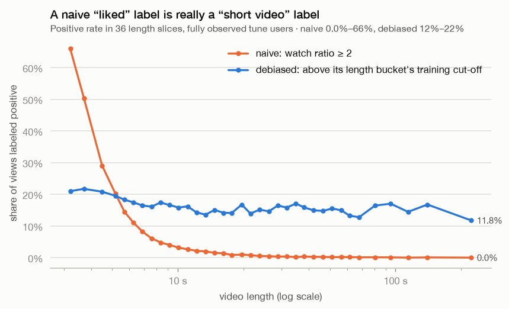

### How often a video was shown says little about how good it is

In the logs, how many times a video was shown is uncorrelated with how often users like it when
everyone sees it. How well it was received in the logs is clearly predictive. That predicts
popularity by view count will be a weak baseline and popularity by engagement rate a strong one,
which is what the baselines below show.

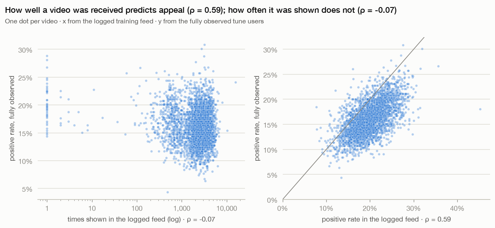

### The logs come from three separate windows

They cover July 5–12, August 1–10 and August 27 to September 5, and the last 7 days are the
validation set. Validation doesn't look like the fully observed test set. It has re-watches
(13.7% of views) and videos never seen in training (12.5%), and the test set has neither. So I
use validation for checks during training, and choose models on a held-out group of fully
observed users instead.

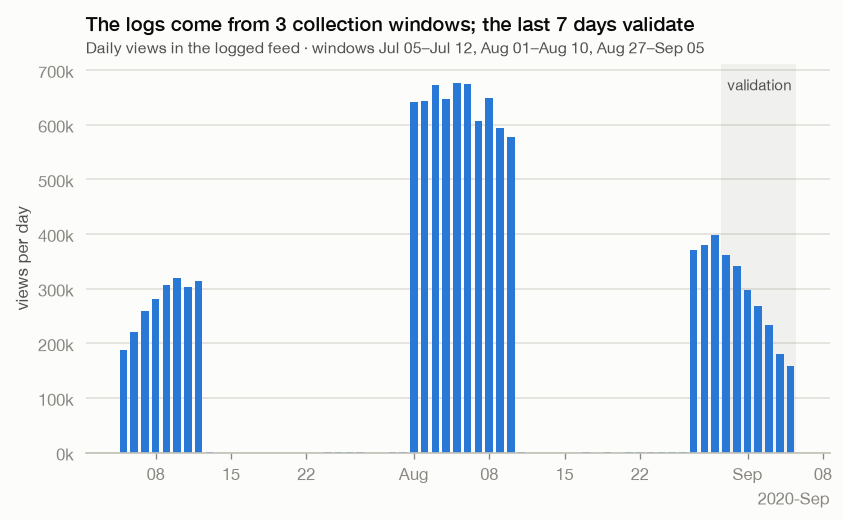

## Baselines

Charts and details are in [`notebooks/02_baselines.ipynb`](notebooks/02_baselines.ipynb). Each
model ranks every candidate video for each of the 299 tune users, and metrics are computed per
user and then averaged. These users also chose ALS's hyperparameters, so these numbers are a
little flattering (more on that below). The real numbers come from the
[test users](#final-results-on-the-test-users).

| Model | NDCG@10 [95% CI] | Coverage@10 | Popularity of recommendations |
|---|---|---|---|
| random | 0.164 [0.143, 0.185] | 59% | 50th percentile |
| popularity by views | 0.184 [0.162, 0.206] | 0.3% | 100th percentile |
| popularity by engagement | 0.217 [0.195, 0.240] | 0.3% | 66th percentile |
| ALS (tuned) | 0.274 [0.246, 0.302] | 22% | 81st percentile |

The EDA prediction holds up. Ranking by view count barely beats random, and ranking by
engagement rate is the best of the non-personalised baselines.

The intervals for ALS and engagement popularity overlap, but that's misleading. On the same
users ALS is better by 0.057 NDCG@10 (CI +0.031 to +0.083). Pairing removes each user's own base
rate, which is the biggest source of noise, the same reason paired designs work well in A/B
tests. The gain isn't spread evenly, though: ALS does better for 57% of users. These intervals
only cover the sampling of users, not random seeds or the choice of candidate videos.

ALS's settings were picked from 36 trials on these same users, so its score is optimistic. A
bootstrap over users (pick the best trial on part of the users, score it on the rest) puts that
optimism at 0.015 NDCG@10, so about 0.259 is a fairer expectation for new users. That's still
well ahead of every popularity baseline.

Across the ALS trials, the more accurate settings also recommend more popular videos. The chosen
one draws its top 10 from around the 81st popularity percentile. The best settings are all within
0.001 of each other, so there's a flat plateau at the top.

It's worth being clear about what this evaluation tests. Tune users have no training views of
any of the 3,327 candidate videos, so ALS has to carry over taste learned from their other
videos (a median of about 33 positive views each). ALS uses Hu et al.'s confidence weighting
`1 + alpha·count`, and users with no positive training views fall back to the average user
vector.

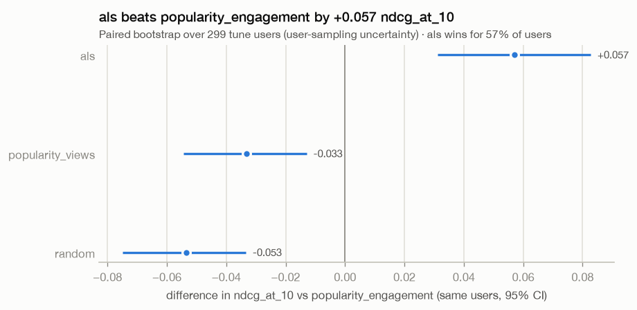

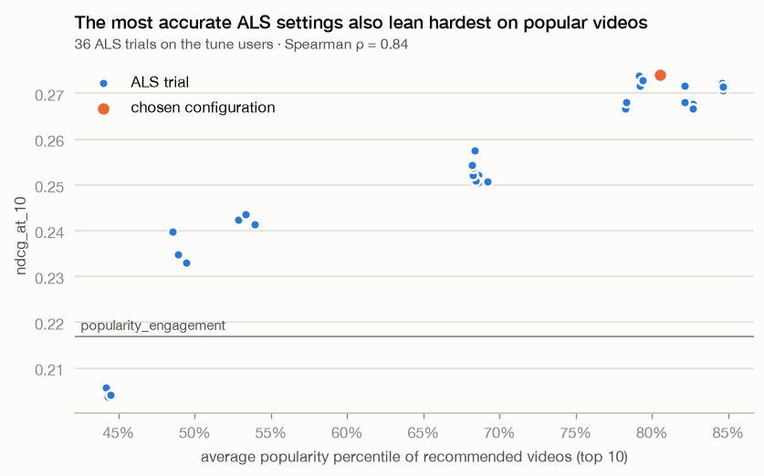

## Two-tower model

Details are in [`notebooks/03_two_tower.ipynb`](notebooks/03_two_tower.ipynb). It uses the same
users and protocol as above, and both ALS and the two-tower model were tuned on these users.

| Model | NDCG@10 [95% CI] | Recall@50 | Coverage@10 | Popularity of recommendations |
|---|---|---|---|---|
| category affinity | 0.199 [0.175, 0.223] | 0.020 | 6% | 59th percentile |
| ALS (tuned) | 0.274 [0.246, 0.302] | 0.030 | 22% | 81st percentile |
| two-tower (3-seed ensemble) | 0.298 [0.271, 0.325] | 0.035 | 11% | 49th percentile |

The choice of loss mattered more than anything about the architecture. A pointwise loss ("will
this user like this video, given it was shown?") beat in-batch softmax with logQ correction
("which video did they like?") in every configuration, 0.287 against 0.252 averaged over seeds.
The pointwise loss asks the same question the evaluation does, and it also learns from views that
weren't positive. With the same number of epochs, though, softmax gets about five times fewer
updates, so this compares the two as I configured them rather than at their best.

A single training run turned out to be a noisy measurement. My first search picked a single-seed
peak of 0.294, which retrained to 0.278. One run varies by 0.003 to 0.006 between seeds, as much
as the gaps I was comparing. So the search now trains every configuration with three seeds and
picks on the average. The best scores 0.287 ± 0.003, or 0.277 after accounting for 0.010 of
selection optimism. Training on CPU is deterministic, so the leaderboard's retrained models match
the search to every digit.

Against ALS on the same users, the ensemble gains 0.024 NDCG@10 (CI −0.000 to +0.048) and does
better for 56% of users. That's borderline here, and the test users settle it later (+0.017, CI
+0.005 to +0.029). Against engagement popularity the gain is clear: +0.081 (CI +0.058 to +0.103),
better for 67% of users.

It's accurate without leaning on popular videos. The two-tower model's top 10 sits at the 49th
popularity percentile, about where random lands, against the 81st for ALS, and it has the best
recall@50.

Taste by category alone doesn't help. Re-weighting engagement popularity by each user's
per-category lift actually lowers NDCG@10 (−0.018, CI −0.034 to −0.002). First-level categories
are too coarse to describe taste and the lifts mostly add noise, so personalisation needs finer
signals like ids and embeddings.

Overfitting kicks in quickly. Every configuration peaks around epochs 5 to 7 and then declines.
The 64-dimensional pointwise model drops from 0.285 at epoch 5 to 0.260 at epoch 10 (averaged
over seeds), which is why the search scores every epoch.

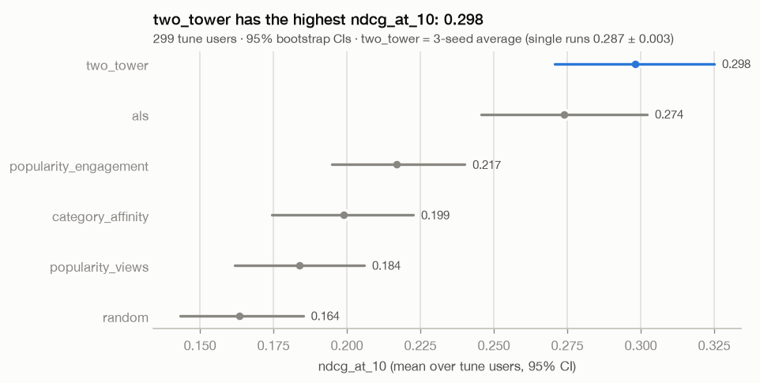

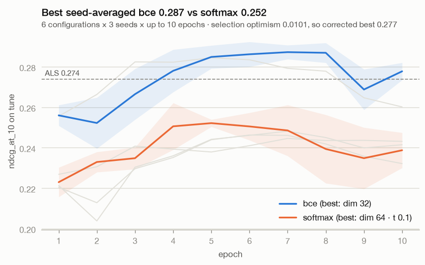

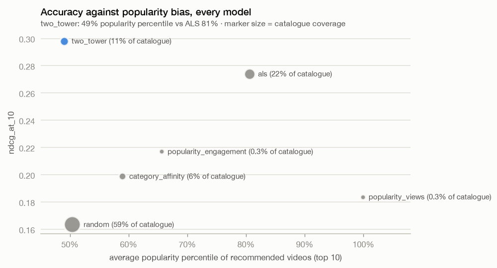

## Re-ranking

Details are in [`notebooks/04_reranker.ipynb`](notebooks/04_reranker.ipynb). The first stage (the
two-tower ensemble) keeps each user's top 200 of about 3,300 candidates, and the second, a
LightGBM LambdaRank model over 19 features, re-orders them.

The re-ranker learns from the validation week: logged views from August 30 onwards, one per
pair, with every feature computed from data before that date. It trains on 4,248 users from
outside the fully observed matrix. Another 533 decide when to stop boosting and which
configuration to keep, and 497 are held back purely for reporting. The 1,411 tune and test users
play no part in training it.

| Model | NDCG@10 [95% CI] | Recall@50 | Popularity of recommendations |
|---|---|---|---|
| ALS | 0.274 [0.246, 0.302] | 0.030 | 81st percentile |
| two-stage (two-tower + re-ranker) | 0.293 [0.267, 0.318] | 0.036 | 56th percentile |
| two-tower alone | 0.298 [0.271, 0.325] | 0.035 | 49th percentile |

Each row below is a paired comparison against ordering by the two-tower score:

| Where | Δ NDCG@10 [95% CI] | Better for |
|---|---|---|
| held-out validation users (logged views) | +0.043 [+0.026, +0.061] | 61% of users |
| tune users, top-200 shortlist re-ranked | −0.005 [−0.023, +0.014] | 48% |
| tune users, every candidate re-ranked | −0.040 [−0.060, −0.018] | 42% |
| tune users, re-ranker cross-fitted on other tune users | +0.002 [−0.019, +0.024] | 48% |

On validation users it never saw, the re-ranker beats two-tower ordering by 0.043. On the 299
tune users there's no detectable gain. When I first wrote this section from the tune users
alone, I concluded the re-ranker didn't help with real preferences. That turned out to be wrong.
The 1,112 test users, opened once at the end, do show a gain of 0.017 (CI +0.006 to +0.027, see
the [final results](#final-results-on-the-test-users)). The tune comparison was too small, and it
favoured the two-tower model, which had been selected on those same users.

Still, only part of the gain on logged data carries over. The re-ranker gains 0.043 on logged
views but 0.017 on fully observed users, so some of what it learns is specific to the logged
feed. Cross-fitting it on the shortlists of other tune users gives +0.002 (CI −0.019 to +0.024),
an interval too wide to tell "no gain" apart from the test result.

The shortlist also protects it. Asked to order all 3,300 candidates, including a long tail that
looks nothing like the views it learned from, the re-ranker does clearly worse (−0.040).
Retrieval keeps it on familiar ground, which is one practical reason two-stage systems shortlist
first.

TreeSHAP, centred within each user, shows what moves videos around a user's list. Engagement
popularity comes first, then video length, then the two-tower and ALS scores, then video age.
Shorter videos move up, because both the validation week and the fully observed users like short
videos slightly more often (the labels are only length-neutral on the training weeks).
Platform-wide like, share and comment rates barely matter.

Retrieval sets the ceiling. The top 200 hold 11% of a tune user's liked videos on average, and a
perfect shortlist would hold 58% (most users like more than 200 of the candidates, so not all of
them fit).

One caveat on fairness: ALS and the two-tower model were tuned on the tune users and the
re-ranker wasn't, which tilts this comparison slightly towards them. A single two-tower run also
varies by about 0.006. The test users give the fair comparison below.

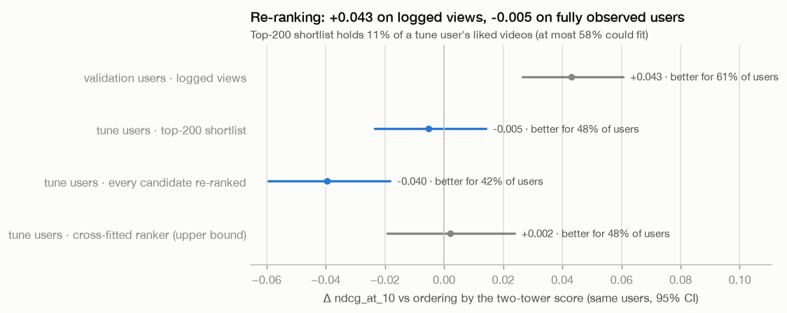

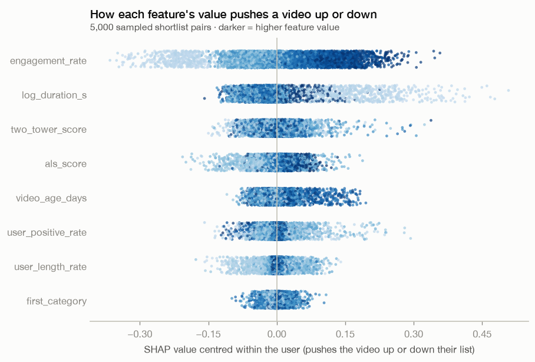

## Final results on the test users

I opened the 1,112 test users once, after every model was frozen. The protocol is the same as
before, with each model ranking all 3,327 candidate videos for each user. Details are in
[`notebooks/05_ab_testing.ipynb`](notebooks/05_ab_testing.ipynb).

| Model | NDCG@10 [95% CI] | Recall@50 | Coverage@10 | Popularity of recommendations |
|---|---|---|---|---|
| random | 0.149 [0.139, 0.159] | 0.015 | 97% | 50th percentile |
| popularity by engagement | 0.208 [0.196, 0.220] | 0.026 | 0.4% | 65th percentile |
| ALS | 0.271 [0.256, 0.286] | 0.036 | 35% | 81st percentile |
| two-tower (3-seed ensemble) | 0.288 [0.274, 0.303] | 0.043 | 16% | 49th percentile |
| two-stage (two-tower + re-ranker) | 0.306 [0.290, 0.320] | 0.042 | 13% | 56th percentile |

| Paired on the same users | Δ NDCG@10 [95% CI] | Better for |
|---|---|---|
| two-stage vs two-tower | +0.017 [+0.006, +0.027] | 52% of users |
| two-tower vs ALS | +0.017 [+0.005, +0.029] | 54% |
| ALS vs engagement popularity | +0.063 [+0.050, +0.076] | 58% |

The test users settle both of the close calls from earlier. The two-tower model beats ALS, and
re-ranking its shortlist adds a real gain. Each step up is worth about 0.017 NDCG@10 and helps
only slightly more users than it hurts (52–54%). Gains that small only show up because the
comparison is paired.

It's better to compare models on the same users than to compare scores across user groups. Every
model except the two-stage pipeline scores lower on test than on tune, even random (0.164 down to
0.149), simply because the test users like fewer of the candidates (15.2% against 16.2%). Score
levels move with the users. Paired differences on the same users don't.

The two neural pipelines also stay away from popularity, recommending around the 49th to 56th
popularity percentile against the 81st for ALS.

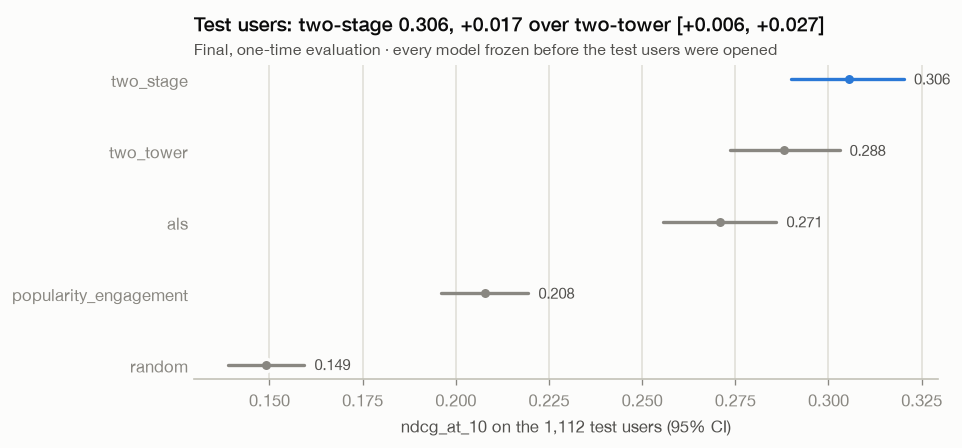

## A/B testing

The details, with each idea explained from scratch, are in
[`notebooks/05_ab_testing.ipynb`](notebooks/05_ab_testing.ipynb).

In an A/B test you split users at random. Control gets the current recommender, treatment gets
the new one, and the difference in some metric between the two groups estimates the new one's
effect. Here each policy builds a 10-video session for every test user (its top 10), and because
the matrix is fully observed I can look up what every user would have done with every policy's
session. The main metric is how many of those videos they liked. Seconds watched is a guardrail,
something a launch shouldn't make worse. Users are assigned by a salted hash of their id, which
put 534 in control and 578 in treatment.

The analysis only sees each user's own arm, as a real test would. But both outcomes are known, so
the true effect is known too (the average over all 1,112 users of treatment minus control), and I
check every method against it by re-randomising the split 2,000 times.

| Policy | random | popularity | ALS | two-tower | two-stage |
|---|---|---|---|---|---|
| Videos liked per session (all test users) | 1.48 | 2.07 | 2.65 | 2.85 | 3.00 |

### Power analysis

Videos liked varies a lot from user to user, with a standard deviation of 2.37. With 534 and 578
users, the smallest effect the test catches 80% of the time (the minimum detectable effect, or
MDE) is 0.40 liked videos per session, about 15% of what ALS gets. CUPED brings that down to 0.31.

### Three experiments

| Experiment (control → treatment) | True effect | Estimate [95% CI] | With CUPED | Decision | Power (plain / CUPED) | Users for 80% power |
|---|---|---|---|---|---|---|
| popularity → ALS | +0.58 | +0.39 [+0.14, +0.64] | +0.46 [+0.27, +0.65] | ship | 99.9% / 100% | 427 (295–675) |
| ALS → two-tower | +0.21 | −0.02 [−0.30, +0.26] | +0.05 [−0.18, +0.27] | inconclusive | 30% / 43% | 4,216 (1,778–19,906) |
| two-tower → two-stage | +0.14 | −0.11 [−0.40, +0.18] | −0.04 [−0.26, +0.19] | inconclusive | 15% / 20% | 9,253 (3,248–94,975) |

Power is the share of the 2,000 re-randomised experiments that detect the true effect. The user
counts cover both arms, use the plain test without CUPED, and allow each arm its own spread. The
range in brackets covers the 95% interval of the effect a new set of users might show, since
these users only pin it down so far. The decision uses the CUPED estimate, the guardrail and the
sample-ratio check.

Only the big effect gets detected, and that's what should happen. Both newer models really are
better, by 0.21 and 0.14 liked videos per session, but both effects are below the MDE, so the
test says "inconclusive". That means there isn't enough evidence, which is different from there
being no effect. Detecting them reliably would take about 4,200 and 9,300 users, and even those
figures are uncertain. For the smaller effect, anywhere from 3,200 to 95,000 users is plausible.

The offline comparison sees these gains because it scores every model on the same users, so each
person's general appetite for liking things cancels out. An A/B test compares different people,
and people vary far more than the effects being measured. That's why it makes sense to screen
ideas offline (or with interleaving) and save A/B traffic for the decisions that need it.

CUPED cuts the variance by 35–44%, which is like having 1.5 to 1.8 times as many users. It
subtracts the part of each user's outcome that their behaviour before the experiment already
predicts, here their positive rate in the training weeks, which correlates about 0.6 with videos
liked. The treatment can't have changed that earlier behaviour, so the estimate stays unbiased.
Across the re-randomisations its average lands within 0.003 of the truth.

The guardrail only catches harms big enough to see. Compared with popularity, ALS really does
lower watch time, by 1.2 seconds per session. The test can't detect a change that small (−3.0 s,
CI −9.9 to +3.8), so the experiment ships anyway.

### Checking the machinery

For an A/A test I compared the two-tower model with itself over 2,000 random splits. 4.65% of
them came out significant (4.75% with CUPED), which matches the 5% the test promises, and the
p-values are spread evenly.

The simulations flip a coin for each user, but the real split uses a hash, so I checked the hash
as well. Splitting the same A/A comparison with 2,000 other salts gives 5.3% false alarms, 4.2%
imbalance in the pre-experiment covariate and 5.3% sample-ratio alarms, all close to what a fair
coin would give. The salt I actually use splits users 534/578 (sample-ratio p = 0.19), with
balanced covariates (p = 0.41).

The 95% intervals contain the true effect 96–99% of the time. That's slightly conservative,
which is expected when the users are fixed and only the assignment is random.

Peeking is where things go wrong. Check after every tenth of the users, stop at the first
p < 0.05, and false alarms jump from 5% to 20%. Always-valid p-values (mSPRT) can be checked at
every look and stay under 5%, at 1% here because the guarantee is conservative. The cost is
power. For the real ALS → two-tower effect it falls from 28% with one look at the end to 8%,
partly because the test is tuned to effects the size of the MDE (0.40), about twice as big as
this one.

The last check is a fake logging bug. Imagine the new version only logs a session once something
gets liked, so the least engaged treatment users vanish from the data. Both arms run the same
policy here, so any lift is fake. Each case goes through the full analysis (CUPED, then the
sample-ratio check, then the decision). CUPED can't undo this bias, because users disappear
because of how they reacted during the experiment.

| Treatment users lost | Estimate (CUPED) [95% CI] | Sample-ratio p-value | Decision |
|---|---|---|---|
| none | −0.16 [−0.39, +0.07] | 0.19 | inconclusive |
| 5% (29) | −0.08 [−0.31, +0.16] | 0.65 | inconclusive |
| 10% (58) | +0.02 [−0.22, +0.25] | 0.67 | inconclusive |
| 20% (116) | +0.24 [−0.01, +0.49] | 0.02 | inconclusive |
| 30% (173) | +0.47 [+0.22, +0.73] | 0.00003 | invalid: sample ratio mismatch |

At 30% the bug fakes a significant lift, 0.63 above the bug-free estimate (p = 0.0003), and the
sample-ratio check blocks it. Smaller losses fake smaller lifts and get through. The hash had
already given treatment 44 extra users, so losing 58 of them actually brings the arms closer to
50/50. A sample-ratio check is a test with limited power too, so a p-value under 0.05 is worth a
look even when it's above the strict 0.001 alarm.

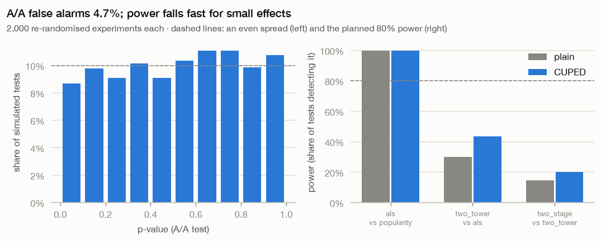

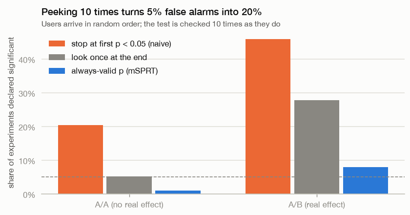

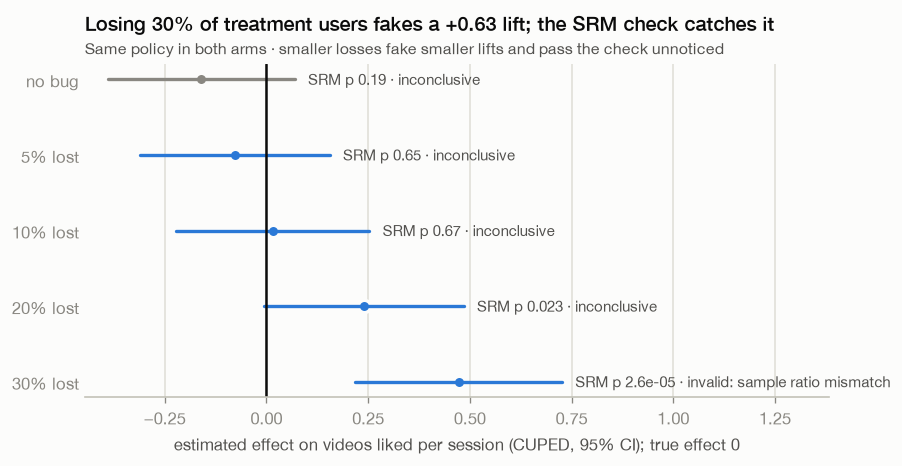

## Streamlit demo

There's a small app for exploring the results. Build its data with `make demo-data`, then run
`make demo` and open http://localhost:8501.

The leaderboard page shows the final test scores with their intervals, plus paired comparisons
against whichever model you pick. The user explorer lets you choose a test user and see the 10
videos each model recommended, what the user actually did with each one, and their history
before the experiment. The A/B lab is the main part. You pick control, treatment, the split and
the significance level, then you can run a single experiment against the true effect, plan how
many users you'd need, repeat it thousands of times to see power, bias and coverage, peek at it
as users arrive, or break the logging and watch the fake lift appear.

The app doesn't load any models. It only reads the reports in git, the per-user A/B outcomes and
two small tables (about 400 KB) from the `demo_data` stage, so it starts in a few seconds and
never touches PyTorch or LightGBM. The lab calls the same statistics code as the `ab_test` stage,
and a test checks that it reproduces the stage's numbers exactly. On a fresh clone without any
data, the overview and leaderboard still work and the other pages tell you which `make` command
to run. Every page is tested headlessly with Streamlit's `AppTest`. Caches are keyed on each
file's modification time, so re-running the pipeline shows up without restarting the app.
Streamlit's usage statistics are switched off in `.streamlit/config.toml`.

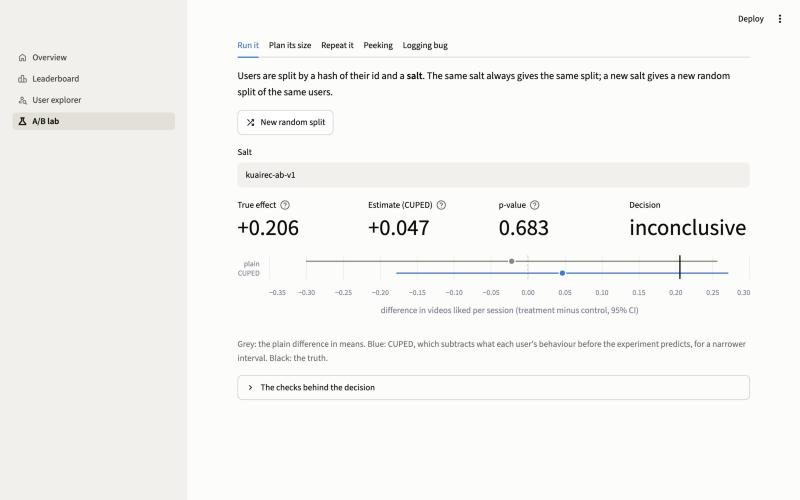

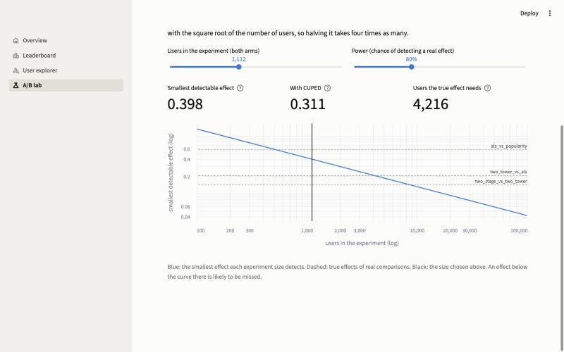

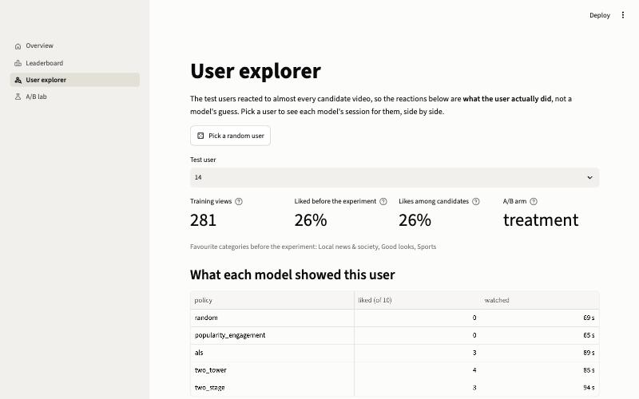

## Experiment tracking

Every training run goes to both MLflow and Weights & Biases through one small interface in
[`tracking.py`](src/recsys/tracking.py). MLflow runs locally against `mlflow.db`, so run
`make mlflow-ui` and open http://127.0.0.1:5000 to browse them. Runs are tagged with the git
commit and whether the working tree was dirty.

W&B runs offline by default, so nothing gets uploaded and you don't need an account. To publish,
run `wandb login` once, then either set `WANDB_MODE=online` or upload past runs with
`wandb sync wandb/offline-run-*`. Keep in mind that `wandb sync` uploads run metadata such as the
hostname and file paths.

For a Bayesian search with W&B Sweeps (this one does need a login), run `make sweep-als` and
start the `wandb agent ...` command it prints. The local grid in `make experiments` doesn't need
an account. Sweeps also select on the tune users, so re-check any winner before trusting it.

## Checkpoints and saved models

Long training runs can be resumed. `TwoTowerRecommender.fit(..., checkpoint_path=...)` saves the
weights, optimiser state and shuffling state after every epoch. Rerun with the same settings and
data and it carries on after the last saved epoch, reproducing an uninterrupted run exactly on
CPU. A checkpoint made with other settings or data is ignored.

The `two_tower_search` stage records every scored configuration, seed and epoch. If it's
interrupted, `dvc repro` picks up where it stopped instead of redoing finished work. That state
lives in `checkpoints/` and is deleted once the stage succeeds.

The leaderboard saves each trained two-tower model to `models/two_tower/` as a DVC output, and
`TwoTowerEnsemble.load("models/two_tower")` restores it with its features. Files are written
under a temporary name and then renamed, so a crash never leaves a half-written checkpoint. They
are loaded with `torch.load(weights_only=True)`, so opening one can't run arbitrary code.

## How the evaluation is set up, and its limits

| Split | Source | Used for |
|---|---|---|
| train | logged feed, before August 30 | fitting models and label cut-offs |
| valid | logged feed, August 30 onwards | checks during training (early stopping) |
| tune | fully observed matrix, 20% of users (stable SHA-256 hash) | model selection and EDA |
| test | fully observed matrix, the other 80% of users | final report and A/B simulation only |

A few things this design does and doesn't guarantee:

- The fully observed matrix covers the same weeks as training, so it measures preferences rather
  than forecasting the future. None of its (user, video) pairs appear in training, and `prepare`
  enforces that.
- "Fully observed" has limits. It covers 3,327 videos, about a third of the catalogue and mostly
  frequently shown ones, and relatively heavy users, with one recorded reaction per pair. The A/B
  simulation can only recommend from those videos, and its results describe those users.
- Users differ a lot in how much they watch, even after the duration fix, so pooled metrics like
  overall AUC mostly measure which users engage. That's why the ranking metrics are per user.
- I never looked at the test users during analysis. The EDA only uses the tune users.
- Training noise adds uncertainty the intervals don't include. A single two-tower run varies by
  about 0.006 NDCG@10 between seeds, so the searches select on seed averages and the leaderboard
  reports the spread.
- ALS and the two-tower model were tuned on the tune users. The searches estimate how much that
  flatters them, and the test users give the final numbers.
- The user profile features that come with the dataset (activity level, follower counts) may
  summarise the whole collection period, including weeks that overlap the evaluation matrix.
  They describe users rather than reactions to videos, so they can't leak a label, but they
  aren't strictly as of the training cut-off.
- The re-ranker learns from logged views, and only part of its gain there (0.043) carries over
  to the test users (0.017). Exposure bias and a shift in time between the validation week and
  the earlier weeks could both explain that, and I didn't separate them.
- The A/B tests replay recorded reactions rather than running live. Each reaction was recorded
  once, in a real feed. A session from a new policy would change what the user saw next
  (position, fatigue, novelty), and a replay can't capture that.
- Cold-start videos aren't evaluated. The video tower can score a video it never saw in training
  from its categories and length, but every tune and test candidate has training views, so that
  ability is only tested on synthetic data.

## Data notes

These came up while building the `prepare` stage. The full numbers are in
`reports/data_summary.json`.

- None of the 4.68M (user, video) pairs in the evaluation matrix appear in the training matrix.
  The pipeline checks this and refuses to write its output if it ever breaks.
- Every user and video in both interaction matrices exists in the user and video tables, which
  the pipeline also enforces.
- 968k rows (7.7%) of the training matrix are duplicate log entries and get dropped. About 2.2k
  of them are the same event filed under two daily partitions, because the source `date` column
  is a log-partition label rather than the date of the event. Re-watches (the same pair at a
  different time) are kept.
- The median `watch_ratio` is about 0.73, but the maximum is 573, from videos left
  looping. The data layer keeps these values as they are, and modelling caps them.
- 3.9% of evaluation rows have no timestamp. The schema allows that there and forbids it in the
  training data.
- Source times are local Asia/Shanghai time. They're stored as a timezone-aware `event_time`
  that reproduces the source `time` column exactly.
- `social_network.csv` (472 users with friend lists) isn't ingested, since no model uses it yet.

## Project layout

```
├── dvc.yaml / dvc.lock      # pipeline definition and pinned output hashes
├── params.yaml              # every setting, read by DVC and recsys.config
├── src/recsys/
│   ├── config.py            # typed, validated access to params.yaml
│   ├── io.py                # shared parquet and JSON writers
│   ├── hashing.py           # stable SHA-256 user assignment (tune/test, A/B arms)
│   ├── data/
│   │   ├── features.py      # label-free user and video features
│   │   ├── download.py      # checksummed, atomic download
│   │   ├── prepare.py       # clean, check for leakage, validate, write parquet
│   │   ├── schemas.py       # pandera data contracts
│   │   ├── labels.py        # duration-debiased relevance labels
│   │   ├── split.py         # train/valid/tune/test split and labelling
│   │   └── categories.py    # English names for the Chinese category labels
│   ├── tracking.py          # MLflow and W&B behind one interface
│   ├── checkpointing.py     # fingerprints, atomic writes, resumable progress logs
│   ├── evaluation/
│   │   ├── ranking.py       # per-user metrics, bootstrap intervals, paired comparisons
│   │   └── concentration.py # Gini, Lorenz curve, top-k share
│   ├── models/              # random, popularity, category affinity, ALS
│   │   └── two_tower/       # encoding, towers and losses, training, checkpoints, ensembles
│   ├── reranking/           # ranking features, LightGBM ranker, two-stage pipeline
│   ├── abtest/              # A/B statistics, sessions and simulated experiments
│   ├── experiments/         # the DVC stages from the searches to the A/B tests
│   ├── demo/                # demo tables, loaders, the A/B lab, charts, Streamlit glue
│   └── viz/
│       └── style.py         # chart style with a colourblind-safe palette
├── app/                     # Streamlit demo (`make demo`)
├── notebooks/               # jupytext .py sources and executed .ipynb
├── sweeps/                  # W&B sweep configs
├── tests/                   # synthetic fixtures, no network or real data needed
├── reports/                 # pipeline metrics and figures, kept in git
├── models/                  # trained models (DVC outputs, not in git)
└── checkpoints/             # resume state for interrupted training (temporary, not in git)
```

## License

The code is MIT licensed (see [LICENSE](LICENSE)). The KuaiRec data isn't included in this
repository. The pipeline downloads it from Zenodo, where it's published under its own license.

## Dataset and citation

KuaiRec is released under [CC BY 4.0](https://zenodo.org/records/18164998). If you use it,
please cite the original paper:

> Chongming Gao, Shijun Li, Wenqiang Lei, Jiawei Chen, Biao Li, Peng Jiang, Xiangnan He,
> Jiaxin Mao, Tat-Seng Chua. *KuaiRec: A Fully-observed Dataset and Insights for Evaluating
> Recommender Systems.* CIKM 2022. [doi:10.1145/3511808.3557220](https://doi.org/10.1145/3511808.3557220)
